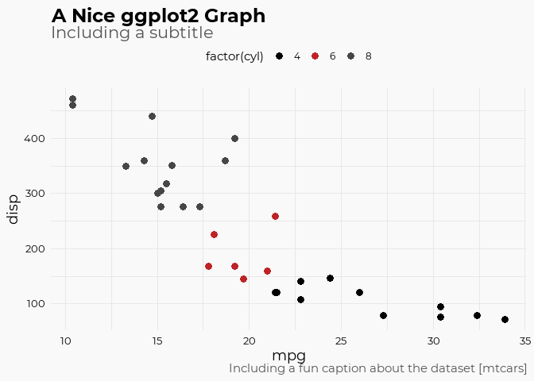

<!-- README.md is generated from README.Rmd. Please edit that file -->

# team brands

# tanger\_styles

r package to help with viz at tanger

For the team &gt;&gt; Enterprise Insights and Analytics

Font &gt;&gt;
<https://fonts.googleapis.com/css?family=Montserrat:300,400,700,900%7CRoboto:300,400,500,900>

ticker &gt;&gt; SKT

Colors … \#000000 &gt;&gt; black, \#464646 &gt;&gt; dark grey, \#C00000
&gt;&gt; red

The goal of team\_brand is to apply the brand style and identity
guidelines. This includes standards for ggplot, highcharter, datatable,
kable, and reactable. This also includes standard CSS documents for use
with R Markdown generated webpages.

## Installation

``` r
remotes::install_github("phildwalker/TeamBrand")
```

## ggplot2: points

``` r
library(ggplot2)
library(TeamBrand)
#> Loading required namespace: sysfonts
#> 
#> Attaching package: 'TeamBrand'
#> The following objects are masked from 'package:ggplot2':
#> 
#>     geom_bar, geom_col, geom_jitter, geom_line, geom_path, geom_point,
#>     geom_step, geom_text

ggplot(mtcars, aes(mpg, disp, color = factor(cyl)))+
  geom_point()+
  scale_color_brand(palette = "mixed")+
  labs(
    title = "A Nice ggplot2 Graph",
    subtitle = "Including a subtitle", 
    caption = "Including a fun caption about the dataset [mtcars]"
  )
```



## ggplot2: bar

``` r
library(tidyverse)
#> -- Attaching packages --------------------------------------- tidyverse 1.3.0 --
#> v tibble  3.0.5     v dplyr   1.0.3
#> v tidyr   1.1.2     v stringr 1.4.0
#> v readr   1.4.0     v forcats 0.5.0
#> v purrr   0.3.4
#> -- Conflicts ------------------------------------------ tidyverse_conflicts() --
#> x dplyr::filter()          masks stats::filter()
#> x TeamBrand::geom_bar()    masks ggplot2::geom_bar()
#> x TeamBrand::geom_col()    masks ggplot2::geom_col()
#> x TeamBrand::geom_jitter() masks ggplot2::geom_jitter()
#> x TeamBrand::geom_line()   masks ggplot2::geom_line()
#> x TeamBrand::geom_path()   masks ggplot2::geom_path()
#> x TeamBrand::geom_point()  masks ggplot2::geom_point()
#> x TeamBrand::geom_step()   masks ggplot2::geom_step()
#> x TeamBrand::geom_text()   masks ggplot2::geom_text()
#> x dplyr::lag()             masks stats::lag()
library(TeamBrand)

mtcars %>% 
  mutate(cyl = as.character(cyl)) %>% 
  ggplot(aes(cyl, fill = cyl))+
  geom_bar()+
  scale_fill_brand(palette = "main")+
  labs(
    title = "Nice ggplot2 bars",
    subtitle = "Including a subtitle", 
    caption = "Including a fun caption about the dataset [mtcars]"
  )
```


